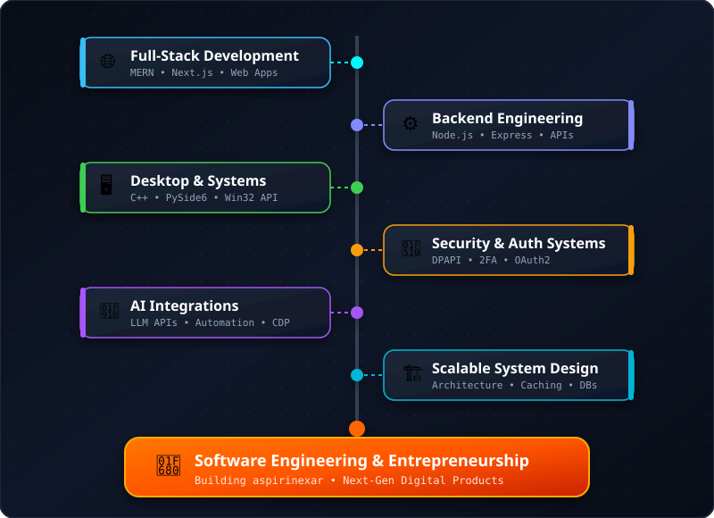
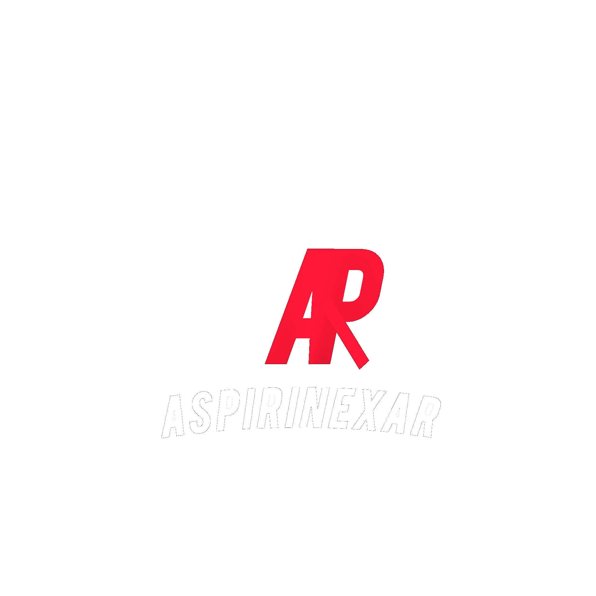

  

<h1 align="center">Hi 👋, I'm Aashish Rajput</h1>

<h3 align="center">🚀 Computer Science Engineer | Full-Stack & Systems Developer | AI & Security Enthusiast</h3>

  

  
  
  

---

<h2 align="center">👤 About Me</h2>

  Computer Science Engineering student specializing in <b>Full-Stack Web Development</b>, <b>Windows Desktop Systems</b>, and <b>Backend Architecture</b>. Experienced in building modern MERN & Next.js web applications, high-performance C++/Python desktop utilities, and secure APIs.

---

<h2 align="center">💻 Tech Stack</h2>

<table align="center" width="100%">
  <thead>
    <tr>
      <th align="center" width="30%">Domain / Category</th>
      <th align="center" width="70%">Technologies, Frameworks & Tools</th>
    </tr>
  </thead>
  <tbody>
    <tr>
      <td align="center"><b>👨‍💻 Languages</b></td>
      <td align="center">
        
      </td>
    </tr>
    <tr>
      <td align="center"><b>🎨 Web & Frontend</b></td>
      <td align="center">
        
      </td>
    </tr>
    <tr>
      <td align="center"><b>⚙️ Backend & Runtime</b></td>
      <td align="center">
        
      </td>
    </tr>
    <tr>
      <td align="center"><b>🗄️ Databases & Storage</b></td>
      <td align="center">
        
      </td>
    </tr>
    <tr>
      <td align="center"><b>🛠️ DevOps, Testing & Tools</b></td>
      <td align="center">
         
        
        
        
        
      </td>
    </tr>
    <tr>
      <td align="center"><b>🖥️ Desktop & Systems</b></td>
      <td align="center">
        
        
        
        
      </td>
    </tr>
    <tr>
      <td align="center"><b>🌐 Browser & Automation</b></td>
      <td align="center">
        
        
        
        
      </td>
    </tr>
    <tr>
      <td align="center"><b>🖼️ Graphics & Screen Capture</b></td>
      <td align="center">
        
        
        
      </td>
    </tr>
    <tr>
      <td align="center"><b>🔐 Security & Encryption</b></td>
      <td align="center">
        
        
      </td>
    </tr>
  </tbody>
</table>

---

<h2 align="center">🎯 Developer Focus & Roadmap</h2>

  

---

<h2 align="center">📊 GitHub Analytics</h2>

<table align="center" width="100%">
  <tr>
    <td width="50%" align="center" valign="top">
      
    </td>
    <td width="50%" align="center" valign="top">
      
    </td>
  </tr>
  <tr>
    <td width="50%" align="center" valign="top">
      
    </td>
    <td width="50%" align="center" valign="top">
      
    </td>
  </tr>
</table>

  
🏆 <b>Click to View GitHub Trophies</b>

   
  

    
  

---

<h2 align="center">🐍 Contribution Snake</h2>

  

---

<h2 align="center">🚀 Featured Projects</h2>

<table>
  <tr>
    <td width="110" align="center" valign="top">
       
      
    </td>
    <td valign="top">
      <h3>🦇 BatmanOverlay</h3>
      
<b>Portable Windows Productivity, Presentation & Desktop Overlay Assistant</b>

      

        A high-performance Windows desktop application combining an embedded Chromium engine (QtWebEngine), CDP browser automation, thread-safe SQLite persistent clipboard, human keystroke simulation (Win32 SendInput), and GPU-accelerated DirectX/DXGI screen capture with native C++ Z-order desktop pinning.
      

      

        
        
        
        
        
        
      

      

        
      

    </td>
  </tr>
</table>

---

  

  © 2026 <b>aspirinexar</b>. All Rights Reserved.

---

<h2 align="center">📫 Connect & Contact</h2>

  
  
  
  

